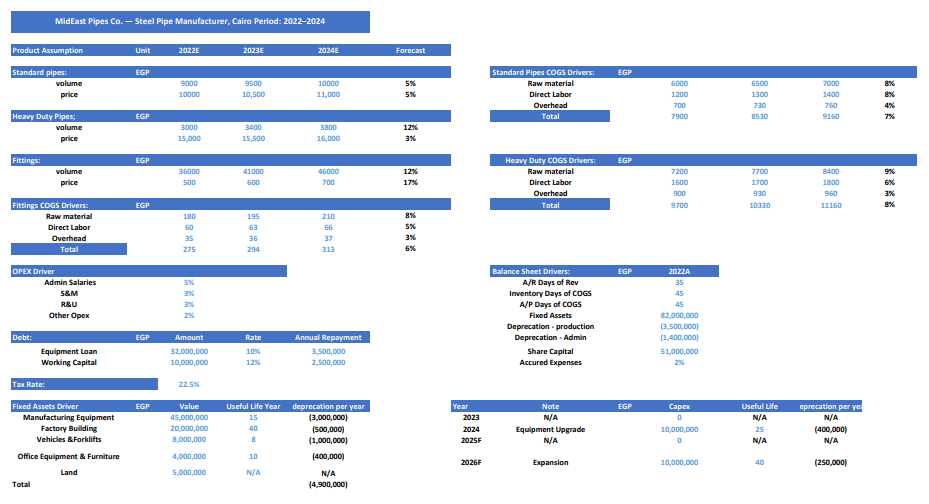

# Driver-Based Three-Statement Financial Model & DCF Valuation — Steel Pipe Manufacturing
Steel Pipe Manufacturing | Cairo, Egypt | 2022–2026

## Overview
Full three-statement financial model and DCF valuation for a fictional Egyptian steel pipe manufacturer. Every output is formula-driven from a centralized assumptions tab. No hardcoded numbers in calculations.

Built to demonstrate end-to-end FP&A skills — from raw assumptions through to equity valuation.

 

## What's Inside

**Assumptions** — Price, volume, and unit costs per product line. Working capital days, depreciation by asset category, dual debt facility, and forecast growth rates.

**Income Statement** — Revenue from price x volume across three product lines. COGS from unit cost x volume. Full P&L from revenue to net income across five years.

**Balance Sheet** — Days-driven working capital. Asset-by-asset depreciation schedule with two capex events. Fully reconciled for all five years.

**Cash Flow Statement** — Indirect method. Working capital changes from balance sheet movements. Closing cash reconciles to balance sheet.

**Sensitivity & DCF** — Two independent dropdowns for volume and COGS stress testing. Unlevered FCF, WACC via CAPM, exit multiple terminal value, WACC vs multiple sensitivity table across 25 scenarios.

## Product Lines
- Standard Pipes (EGP/ton)
- Heavy Duty Pipes (EGP/ton)
- Fittings & Accessories (EGP/unit# MidEast Pipes Co. — Financial Model & DCF Valuation
Steel Pipe Manufacturing | Cairo, Egypt | 2022–2026

## Overview
Full three-statement financial model and DCF valuation for a fictional Egyptian steel pipe manufacturer. Every output is formula-driven from a centralized assumptions tab. No hardcoded numbers in calculations.

Built to demonstrate end-to-end FP&A skills — from raw driver-based assumptions through to equity valuation.

## What's Inside

**Assumptions** — Price, volume, and unit costs per product line with individual growth rates for each driver. Working capital days, depreciation by asset category, dual debt facility, and forecast growth rates. Any change in an input flows automatically through the entire model.

**Income Statement** — Revenue from price x volume across three product lines. COGS from unit cost x volume per product, with each cost component growing independently. Full P&L from revenue to net income across five years.

**Balance Sheet** — Days-driven working capital. Asset-by-asset depreciation schedule with two capex events in 2024 and 2026. Dual debt facility with separate repayment treatment. Fully reconciled across all five years.

**Cash Flow Statement** — Indirect method. Working capital changes derived from balance sheet movements. Closing cash reconciles to balance sheet for all five years.

**Sensitivity Analysis** — Two independent dropdown selectors for volume shock and COGS shock across 2025F and 2026F. Each flows dynamically through all three statements simultaneously via XLOOKUP.

**DCF Valuation** — Unlevered FCF across five years. WACC of 23% built from CAPM cost of equity and blended after-tax cost of debt weighted by capital structure. Terminal value calculated using both exit multiple (6x EBITDA) and Gordon Growth Model (3%) for comparison. 25-scenario sensitivity table across WACC and EBITDA multiple combinations.

## Key Results
- Revenue grows from 153M to 270M EGP across the five year period
- Equity Value: 133.6M EGP | Valuation Range: 101.7M — 175.3M EGP
- WACC: 23% | Beta: 0.9 | Risk Free Rate: 27% | Terminal Value Method: Exit Multiple 6x EBITDA

## Product Lines
- Standard Pipes (EGP/ton)
- Heavy Duty Pipes (EGP/ton)
- Fittings & Accessories (EGP/unit)

## Skills Demonstrated
Driver-based financial modeling, three-statement integration, price x volume x cost decomposition, working capital analysis, depreciation scheduling, debt modeling, DCF valuation, WACC via CAPM, sensitivity analysis, scenario stress testing

## Tools
Microsoft Excel

## Skills
Three-statement modeling, driver-based forecasting, price x volume x cost decomposition, working capital analysis, depreciation scheduling, debt modeling, DCF valuation, WACC, sensitivity analysis

## Tools
Microsoft Excel
